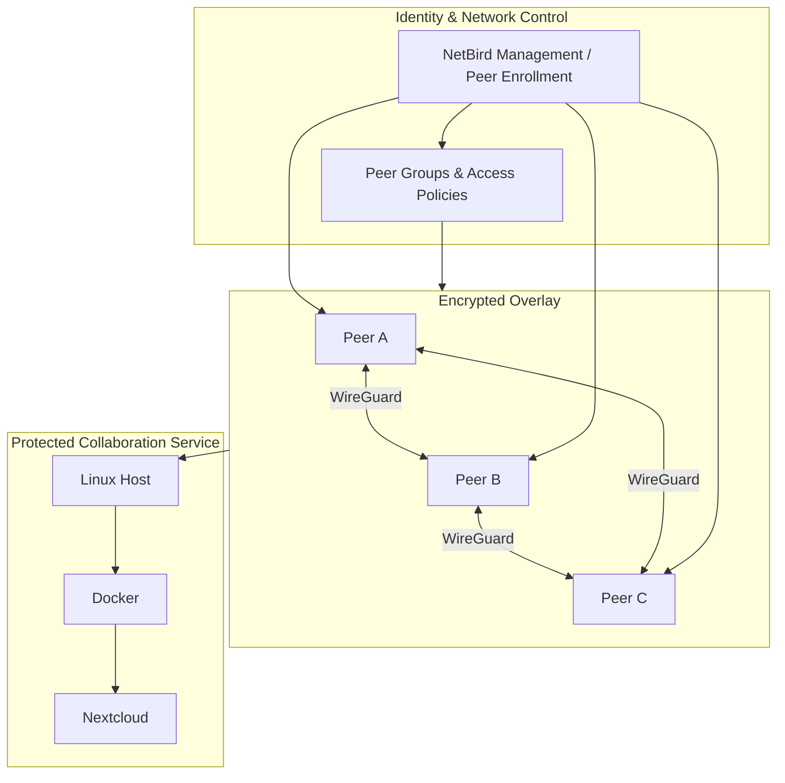
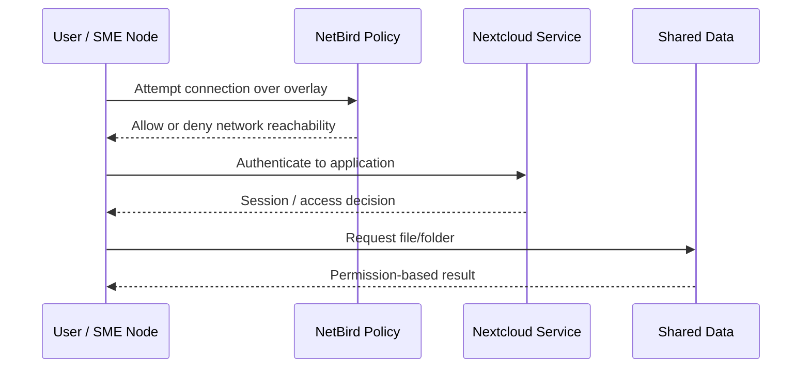

# Architecture

## Goal

Create a controlled collaboration environment for multiple distributed SME nodes without relying on unrestricted public network reachability.

## Logical architecture

The diagram is intentionally logical. It does not publish historical public/private addresses, credentials, setup keys, or other environment-specific values.

## Components

### NetBird / WireGuard

NetBird provided the secure overlay and policy plane around WireGuard-based peer connectivity. The project used peer enrollment and policy configuration to avoid treating every connected node as universally trusted.

### Cloud-hosted Linux nodes

The project scenario used cloud-hosted Linux instances to represent distributed participants. Public portfolio documentation abstracts the original addressing and credentials.

### Dockerized Nextcloud

Nextcloud represented the shared collaboration service. Containerization made the service deployable and isolated its application packaging from the underlying Linux host.

### Access-control layers

A central architectural point is that access control occurs at more than one layer:

| Layer | Concern | Example control |
| --- | --- | --- |
| Overlay / network | Can peer X reach service Y? | NetBird policy/group rules |
| Application | Can user X sign in? | Nextcloud authentication |
| Data | Can user X access/share object Y? | Nextcloud user/group/folder permissions |

Network reachability is therefore necessary for some flows but is **not equivalent to authorization to the data itself**.

## Trust boundaries

1. **Internet → enrolled peer:** an arbitrary Internet host should not gain the same trusted path as an enrolled overlay peer.
2. **Peer → peer/service:** being enrolled does not imply unrestricted east-west reachability.
3. **Network → application:** reaching Nextcloud does not imply authorization to every account or file.
4. **Host → containerized service:** deployment/runtime configuration forms a separate operational boundary.

## Data-flow example

## What this architecture does not claim

The final team report contains inconsistent references to Ryu, SDN, and VNF. The portfolio does not place those elements in the verified architecture because the surviving evidence used for this reconstruction does not support them at the same level as NetBird, Nextcloud, cloud peers, policies, and connectivity tests.
