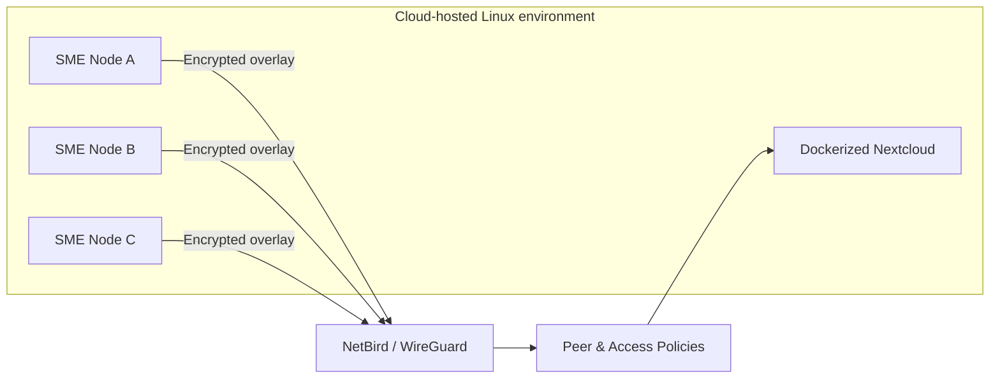

# Zero Trust NetBird Secure Overlay

> Portfolio case study of a collaborative university network-security project that designed and evaluated a secure overlay for distributed SME collaboration using NetBird/WireGuard, Dockerized Nextcloud, and cloud-hosted Linux nodes.


## Why this project matters

Distributed teams need to exchange files and reach internal services without exposing those services broadly to the public Internet. This project explored a practical Zero Trust-style approach: authenticated peers join an encrypted overlay, reachability is restricted by policy, and collaboration services sit behind that controlled network path.

This portfolio intentionally focuses on the parts supported by surviving project evidence: **NetBird/WireGuard overlay networking, cloud-hosted Linux peers, Dockerized Nextcloud, peer/policy configuration, access-control scenarios, and connectivity validation.**

## My role

I served as the **Group Lead (Ketua Kelompok)** and was also a hands-on technical contributor. My responsibilities included coordinating the team, helping shape the implementation and validation plan, reviewing technical work across the project, and contributing to the network/security implementation and final project delivery.

This was a **collaborative team project**. This repository is a curated portfolio reconstruction and does not claim sole authorship of every implementation artifact.

## Architecture at a glance



The design separates two control layers:

- **Network access control:** NetBird peer/group/policy rules determine which peers or services are reachable.
- **Application/data access control:** Nextcloud users, groups, and sharing permissions determine which files/folders can be accessed after network reachability is established.

## What was implemented and validated

| Area | Portfolio claim | Evidence level |
| --- | --- | --- |
| Secure overlay | NetBird peers connected through a WireGuard-based overlay | Strong |
| Cloud nodes | Multiple Linux nodes were deployed for the collaboration scenario | Strong |
| Collaboration service | Nextcloud was deployed using Docker | Strong |
| Network policy | Peer/group access policies were configured and tested | Strong |
| Connectivity | Peer reachability was validated with network tests | Strong |
| File collaboration | Nextcloud account/folder/sharing scenarios were exercised | Strong |
| JWT/authentication layer | Described in the project report, but surviving source-level evidence is weaker | Report-described |
| Ryu/SDN/VNF | Inconsistently referenced in the report and therefore **not presented here as a verified implementation** | Not claimed |

See [SOURCE_EVIDENCE.md](SOURCE_EVIDENCE.md) and [docs/REPORT_CONSISTENCY_NOTES.md](docs/REPORT_CONSISTENCY_NOTES.md) for the evidence policy used in this portfolio.

## Zero Trust interpretation

This project is best understood as a **practical Zero Trust-inspired secure overlay**, not as a claim of implementing every component of a complete enterprise ZTNA platform.

The design applies several useful principles:

1. **Do not trust network location alone.** Devices first join an authenticated overlay.
2. **Encrypt peer traffic.** NetBird uses WireGuard for encrypted connectivity.
3. **Reduce implicit reachability.** Access policies define which peers/groups may communicate.
4. **Separate network and application authorization.** Network policy does not replace Nextcloud permissions.
5. **Validate controls.** Connectivity and access scenarios were tested from multiple nodes.

More detail: [ZERO_TRUST_MODEL.md](ZERO_TRUST_MODEL.md).

## Repository map

```text
.
├── README.md
├── PORTFOLIO.md
├── ARCHITECTURE.md
├── ZERO_TRUST_MODEL.md
├── NETWORK_OVERLAY.md
├── ACCESS_CONTROL.md
├── TESTING.md
├── RESULTS.md
├── TEAM_ATTRIBUTION.md
├── SOURCE_EVIDENCE.md
├── SECURITY.md
├── LIMITATIONS.md
├── docs/
│   ├── IMPLEMENTATION_EVIDENCE.md
│   ├── REPORT_CONSISTENCY_NOTES.md
│   ├── REPORT_REDACTION_NOTICE.md
│   ├── THREAT_MODEL.md
│   └── DEPLOYMENT_NOTES.md
└── examples/
    ├── README.md
    ├── netbird-policy.example.md
    └── docker-compose.nextcloud.example.yml
```

## Security and publication policy

The original project material contained environment-specific infrastructure data. This public portfolio intentionally excludes or sanitizes credentials, private keys, activation material, historical infrastructure addresses, sessions, API keys, and other deployment secrets.

Do **not** treat the original report as a safe public deployment guide without first removing sensitive values. See [SECURITY.md](SECURITY.md) and [docs/REPORT_REDACTION_NOTICE.md](docs/REPORT_REDACTION_NOTICE.md).

## Skills demonstrated

`Zero Trust` · `Network Security` · `NetBird` · `WireGuard` · `Linux` · `AWS EC2` · `Docker` · `Nextcloud` · `Access Control` · `Network Validation` · `Technical Leadership` · `Security Documentation`

## Portfolio positioning

For recruiters and interviewers, this project demonstrates that I can reason about **network boundaries, secure connectivity, access-control layers, Linux/cloud deployment, verification, and team coordination**.

A condensed recruiter-facing version is available in [PORTFOLIO.md](PORTFOLIO.md).

---

### Attribution

Collaborative academic project. I served as **Group Lead (Ketua Kelompok)** and technical contributor. The material in this repository is a sanitized portfolio reconstruction based on the team project's surviving documentation and evidence.