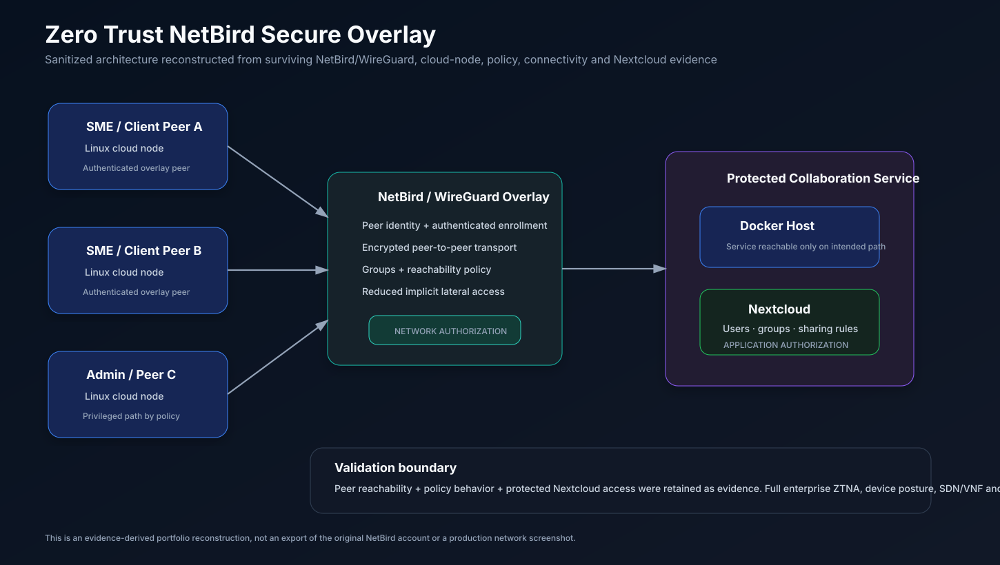
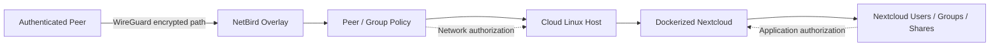

# Zero Trust NetBird Secure Overlay

> Portfolio case study of a collaborative university network-security project that designed and evaluated a secure overlay for distributed SME collaboration using NetBird/WireGuard, Dockerized Nextcloud, and cloud-hosted Linux nodes.


[](https://github.com/syifaniads/zero-trust-netbird-secure-overlay/actions/workflows/validate-examples.yml)

## Why this project matters

Distributed teams need to exchange files and reach internal services without exposing those services broadly to the public Internet. This project explored a practical Zero Trust-style model: peers first join an authenticated encrypted overlay, reachability is constrained by policy, and application authorization remains a separate control inside Nextcloud.

This portfolio intentionally focuses on what the surviving project evidence supports: **NetBird/WireGuard overlay networking, cloud-hosted Linux peers, Dockerized Nextcloud, peer/group policy, access-control scenarios, and connectivity validation.**

<p align="center">
  
</p>

The visual above is a sanitized reconstruction from the retained architecture and implementation evidence. It is **not an export of the original NetBird account, a fabricated dashboard screenshot, or proof of a production ZTNA deployment**.

## Senior technical review path

A reviewer can verify the engineering story from the underlying artifacts:

1. **Architecture and trust boundaries:** [ARCHITECTURE.md](./ARCHITECTURE.md), [ZERO_TRUST_MODEL.md](./ZERO_TRUST_MODEL.md), and [docs/THREAT_MODEL.md](./docs/THREAT_MODEL.md).
2. **Overlay networking:** [NETWORK_OVERLAY.md](./NETWORK_OVERLAY.md) and [docs/IMPLEMENTATION_EVIDENCE.md](./docs/IMPLEMENTATION_EVIDENCE.md).
3. **Policy model:** [ACCESS_CONTROL.md](./ACCESS_CONTROL.md) and [`examples/netbird-policy.example.md`](./examples/netbird-policy.example.md).
4. **Application layer:** [`examples/docker-compose.nextcloud.example.yml`](./examples/docker-compose.nextcloud.example.yml) and [docs/DEPLOYMENT_NOTES.md](./docs/DEPLOYMENT_NOTES.md).
5. **Validation:** [TESTING.md](./TESTING.md), [RESULTS.md](./RESULTS.md), and [`scripts/validate_examples.py`](./scripts/validate_examples.py).
6. **Evidence discipline:** [SOURCE_EVIDENCE.md](./SOURCE_EVIDENCE.md), [TEAM_ATTRIBUTION.md](./TEAM_ATTRIBUTION.md), [LIMITATIONS.md](./LIMITATIONS.md), and [docs/REPORT_CONSISTENCY_NOTES.md](./docs/REPORT_CONSISTENCY_NOTES.md).

## My role

I served as the **Group Lead (Ketua Kelompok)** and a hands-on technical contributor. My responsibilities included coordinating the team, helping shape implementation and validation, reviewing technical work across the project, contributing to the network/security implementation, and consolidating the final delivery.

This was a **collaborative team project**. The repository is a curated portfolio reconstruction and does not claim sole authorship of every original artifact.

## Architecture and authorization layers

The design intentionally separates network reachability from application authorization:



- **Network authorization:** NetBird peer/group/policy rules determine which peers and services can communicate.
- **Application authorization:** Nextcloud users, groups, folder ownership, and sharing rules determine what data is accessible once a network path exists.

This distinction matters: an encrypted tunnel alone is not Zero Trust, and network access alone should not imply access to application data.

## What was implemented and validated

| Area | Portfolio claim | Evidence level |
| --- | --- | --- |
| Secure overlay | NetBird peers connected through a WireGuard-based overlay | **Strong** |
| Cloud nodes | Multiple Linux nodes were deployed for the collaboration scenario | **Strong** |
| Collaboration service | Nextcloud was deployed using Docker | **Strong** |
| Network policy | Peer/group access policies were configured and tested | **Strong** |
| Connectivity | Peer reachability was validated with network tests | **Strong** |
| File collaboration | Nextcloud account/folder/sharing scenarios were exercised | **Strong** |
| JWT/authentication layer | Described in the project report, but surviving source-level evidence is weaker | **Report-described** |
| Ryu/SDN/VNF | Inconsistently referenced in the report and therefore not presented as verified | **Not claimed** |
| Public example integrity | Compose syntax, secret indirection, persistence and policy model checked in CI | **Automated portfolio check** |

See [SOURCE_EVIDENCE.md](SOURCE_EVIDENCE.md) for the evidence basis behind each claim.

## Zero Trust interpretation

This project is best described as a **practical Zero Trust-inspired secure overlay**, not a complete enterprise ZTNA implementation. The design demonstrates several defensible principles:

1. **Network location is not treated as sufficient trust.** A device must first join the authenticated overlay.
2. **Peer traffic is encrypted.** NetBird uses WireGuard as the secure transport layer.
3. **Reachability is policy-constrained.** Groups and allow rules reduce implicit all-to-all access.
4. **Network and application authorization remain separate.** NetBird policy does not replace Nextcloud authorization.
5. **Controls are validated.** Peer connectivity and application-access scenarios were tested from multiple nodes.

The project does **not** claim device-posture enforcement, enterprise identity federation, continuous risk scoring, microsegmentation across every workload, SDN/VNF orchestration, or production high availability where retained evidence does not support those claims.

## Sanitized deployment example

The public Compose file is intentionally an **illustrative, sanitized deployment example**, not a byte-for-byte export of the historical environment:

```text
examples/docker-compose.nextcloud.example.yml
├── MariaDB 11
│   └── persistent db_data volume
└── Nextcloud stable
    └── persistent nextcloud_data volume
```

Database credentials are supplied through environment variables instead of literal values committed in the repository. The example currently publishes the application port for lab use; the intended security model is to make the service reachable only through the approved protected network path in a real deployment.

## Automated repository validation

GitHub Actions runs two checks on every push/PR:

- [`scripts/validate_examples.py`](./scripts/validate_examples.py) checks that the Nextcloud/MariaDB example retains environment-driven secrets, persistent volumes, the documented NetBird policy groups, least-reachability intent, and no obvious literal secret assignments.
- `docker compose config` parses the Compose example with validation-only environment values so malformed YAML/Compose changes are caught early.

These checks validate **portfolio artifact integrity**. They do not pretend to prove a live WireGuard tunnel, NetBird control plane, AWS instance, or Nextcloud runtime.

## Security and publication policy

The original project material contained environment-specific infrastructure data. This public portfolio intentionally excludes or sanitizes credentials, private keys, activation/setup material, historical infrastructure addresses, sessions, API keys, and deployment secrets.

See [SECURITY.md](SECURITY.md) and [docs/REPORT_REDACTION_NOTICE.md](docs/REPORT_REDACTION_NOTICE.md).

## Repository map

```text
.
├── README.md
├── ARCHITECTURE.md
├── ZERO_TRUST_MODEL.md
├── NETWORK_OVERLAY.md
├── ACCESS_CONTROL.md
├── TESTING.md
├── RESULTS.md
├── SOURCE_EVIDENCE.md
├── TEAM_ATTRIBUTION.md
├── LIMITATIONS.md
├── docs/
│   ├── assets/secure-overlay.svg
│   ├── IMPLEMENTATION_EVIDENCE.md
│   ├── REPORT_CONSISTENCY_NOTES.md
│   ├── REPORT_REDACTION_NOTICE.md
│   ├── THREAT_MODEL.md
│   └── DEPLOYMENT_NOTES.md
├── examples/
│   ├── netbird-policy.example.md
│   └── docker-compose.nextcloud.example.yml
└── scripts/
    └── validate_examples.py
```

## Skills demonstrated

`Zero Trust` · `Network Security` · `NetBird` · `WireGuard` · `Linux` · `AWS EC2` · `Docker` · `Nextcloud` · `Access Control` · `Network Validation` · `Threat Modeling` · `Security Documentation`

---

### Attribution

Collaborative academic project. I served as **Group Lead (Ketua Kelompok)** and technical contributor. The material in this repository is a sanitized portfolio reconstruction based on the team project's surviving documentation and evidence.
