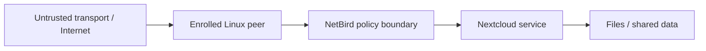

# Threat Model

## Protected assets

- collaboration data stored in Nextcloud;
- authenticated user accounts;
- enrolled overlay peers;
- network policy configuration;
- Linux/cloud host integrity;
- enrollment/setup material.

## Trust boundaries

## Threats considered

### Unauthorized network reachability

**Risk:** an unintended peer can reach a protected service.  
**Primary control:** NetBird peer/group policies, enrollment governance, host firewalling.

### Lateral movement

**Risk:** one compromised peer can reach unrelated peers/services.  
**Primary control:** least-privilege network policy rather than broad all-to-all connectivity.

### Credential or setup-key exposure

**Risk:** an attacker enrolls a rogue peer or accesses cloud/application resources.  
**Primary control:** secret hygiene, key rotation, restricted lifetime/scope, no secrets in public repositories.

### Unauthorized file access

**Risk:** a network-authorized user gains access to data they should not see.  
**Primary control:** Nextcloud authentication, user/group permissions, share policy.

### Compromised endpoint

**Risk:** encrypted overlay membership is abused from a compromised enrolled host.  
**Primary control in a production design:** patching, endpoint hardening, device posture, EDR, logging, revocation.

### Public service exposure

**Risk:** protected services become broadly reachable because of cloud firewall/security-group mistakes.  
**Primary control:** minimize public listeners, restrict cloud firewall/security groups, route intended access over the overlay.

## Residual risk

The project prototype does not demonstrate enterprise-grade endpoint posture, centralized identity governance, SIEM correlation, HA, or automated policy compliance. These are production extensions rather than claimed features of the academic implementation.
